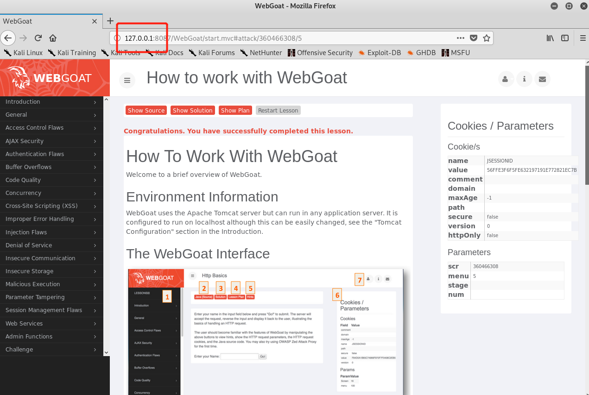
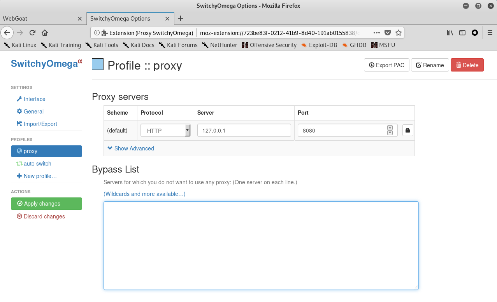

# Web 应用漏洞攻防 
## 实验目的 
- 了解常见 Web 漏洞训练平台；
- 了解 常见 Web 漏洞的基本原理；
- 掌握 OWASP Top 10 及常见 Web 高危漏洞的漏洞检测、漏洞利用和漏洞修复方法；
  
## 实验环境
- WebGoat
- Juice Shop
## 实验要求 

- 每个实验环境完成不少于 5 种不同漏洞类型的漏洞利用练习
- 
## 实验过程 
### 一、webgoat环境下的漏洞攻防 ###
### WebGoat环境搭建 ###
- 安装docker-compose
  `apt update&&apt install docker-compose`
- 将老师写好的文件git clone到该目录下
- `git clone https://github.com/c4pr1c3/ctf-games.git`
- 安装docker-compose
  `docker-compose up-d`
  
  
  
  

- 打开浏览器输入网址127.0.0.1/WebGoat/attack，输入用户名、密码登录Webgoat页面来验证安装是否成功
  

-  浏览器添加插件ProxySwitchyOmega，设置proxy
  
- 设置burpsuite的intercept is on，即相当于设置断点，方便调试、转发
  

### 一、未验证的用户输入漏洞 ###
- 浏览器添加插件ProxySwitchyOmega，设置proxy
- burpsuite设置为intercept is on,回到我们将要提交数据的界面，点击submit,可以看到burpsuite拦截到了我们提交的信息。
  
- 在burpsuite中对拦截到的信息的字段进行修改，并且点击forward将其提交上去，成功实现了绕过html字段的限制。
  
  

### 2.XSS跨站脚本攻击 ###
####  实验目的：
 - 通过xss攻击获取受害者的cookie
 - 把cookie以参数的形式发送到目标服务器中

- 输入以下代码弹出页面cookie值
  
  
- 此时弹出了一个网页，其URL为
http://127.0.0.1:8087/WebGoat/catcherPROPERTY=yes&msg=JSESSIONID=4DC9F3FCD8CD3215786AE469A89699F9
此url中msg参数和之前弹窗弹出来的cookie相同，实验成功
  
  

### 3.脆弱访问控制 ###
- 原理：普遍身份认证流程中常见的缺陷模式包括：简单易猜解的用户名和用户⼝令；由于第三方认证凭据泄漏导致的撞库攻击；存在缺陷的身份管理功能，例如口令修改、忘记口令 功能设计不当会导致所有用户口令可以被任意修改，进而被任意身份仿冒。
  
  
- 输入用户名admin，出现密保，挨着输入各种颜色，直至出现如图提示后，表示攻击成功得到密码。
  

### 4.脆弱认证和会话管理 ###
  **原理**：常见的 Web 应用会话管理功能实现是依赖于客户端的 Cookie 和服务端的 Session 机制的。客户端 Cookie 中通常会记录服务端代码设置的一个随机长字符串作为 Session ID，服务端代码使用客户端发送来的 Cookie 中这个 Session ID 在服务端的 Session 列表中找到匹配 Session 对象，进而就可以知道用户是谁。这里的 Session ID 我们一般称为会话令牌。
- 在邮件正文的链接中中加入Session ID。
  
- 点击提交后我是收件人Jane。点击弹出页面中的链接“Goat Hills Financial”。
  
- 以用户名Jane，密码tarzan登陆。
  
- 在浏览网页时，看到浏览器网址中我们的SID是“NOVALIDSESSION” 。
  
- 将SID修改为最开始的邮件中填入的“WHATEVER”，实验成功 。
  

### 5.注入缺陷 ###
- 初始登陆界面，需要输入PASSWORD
  
- 修改password内容为 ' or '1'='1。
  
- 实现绕过密码登陆。
  
  

### 二、Juice Shop环境下的漏洞攻防 ###
### Juice shop环境搭建 ###
- 安装`docker-compose up -d`
  
- 进入JuiceShop后查找计分板
  
  
- 访问对应网址，寻找计分板成功。
  

### sql注入缺陷 ###
- 在用户名部分输入'or 1=1--，密码随意填写。
  
- 成功实现绕过密码登陆
  

### 脆弱认证 ###
- 实验方法：通过忘记密码，更改用户密码。
- 输入Bjoern的owasp账户，密保问题是问最喜欢的宠物。
  
- 通过互联网信息搜索，发现他有一只猫叫'Zaya'，尝试填入答案，并进行密码重置，成功实现密码重置。
  

### 敏感数据曝光/遗忘信息 ###
- 在/#/about 页面中通过开发者工具找到【使用条款】的对应href=“/ftp/legal.md”。
- 根据左下角的路径访问ftp链接。
- 点开文件可以看到机密文件内容，实现了获取。
  
  
  
- 点开文件可以看到机密文件内容，实现了获取。
  
 

### 脆弱访问控制 ###
- 实验目的：查看另一个用户的购物车。
- burpsuite设置为intercept is on，然后点击我的购物车，在burpsuite中可以看到我们抓到的包,第一行为GET /rest/basket/5 HTTP/1.1。
  
- 将basket后的5改为6，点击forward
  
- 实验成功
  

# 参考资料
[hyf作业](https://github.com/CUCCS/2019-NS-Public-huangyifei416/tree/chap0x07)
[DXY作业](https://github.com/CUCCS/2019-NS-Public-DXY0411/tree/ns_chap0x07)

