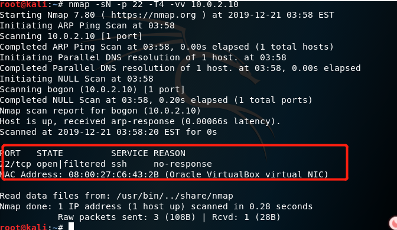
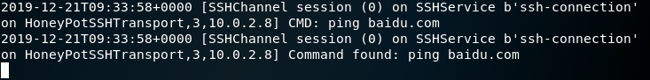

# 常见蜜罐体验和探索
## 实验目的

* 了解蜜罐的分类和基本原理
* 了解不同类型蜜罐的适用场合
* 掌握常见蜜罐的搭建和使用

## 实验环境

* 从 paralax/awesome-honeypots中选择 1 种低交互蜜罐和 1 种中等交互蜜罐进行搭建实验
    * 推荐 SSH 蜜罐

实验要求

* 记录蜜罐的详细搭建过程；
* 使用 nmap 扫描搭建好的蜜罐并分析扫描结果，同时分析「 nmap 扫描期间」蜜罐上记录得到的信息；
* 如何辨别当前目标是一个「蜜罐」？以自己搭建的蜜罐为例进行说明；
## 实验过程
* **对蜜罐的理解**
  故意引诱黑客来攻击自己，从而得知对方攻击自己采取的手段
* 网络拓扑
  kali-attacker
  kali-victim
  
* 网络测试
  
  
### 搭建蜜罐
* 1.clone低交互蜜罐
  
* 2.默认22端口给蜜罐使用，编辑配置文件将ssh的端口号改为一个不常用的端口号56
  `vi/etc/ssh/sshd_config`
* 3.重启ssh并安装docker
  `service ssh restart`
  `apt-get install docker docker-compose`
* 4.按照参考文档中给出的步骤依次输入
  `apt install libssh-dev libjson-c-dev`
  `make`//进行编译
  `ssh-keygen -t rsa -f ./ssh-honeypot.rsa`
  `bin/ssh-honeypot -r ./ssh-honeypot.rsa`
  
* cowrie搭建
  1.将cwrie下载到**victim**本地
  `git clone https://githubcom/cowrie/cowriegit`
  2.启动docker,下载镜像
  `docker pull cowrie/cowrie`
  3.成功运行，cowrie蜜罐搭建成功
  
## 蜜罐测试
### 使用nmap扫描搭建好的蜜罐并分析扫描结果
#### ssh-Honeypot
 * 使用nmap扫描搭建好的蜜罐并分析扫描结果victim1的IP地址是10.0.2.10）
 * 观察到输入的测试密码显示在运行蜜罐的victim1界面。由此可见，SSH-honeypot是一个低交互式蜜罐，无法完成SSH连接
  
  
##### TCP stealth scan
收到syn-ack，说明端口为打开状态

##### XMAS scan
22端口为打开或过滤状态

##### FIN scan 
22端口为打开或过滤状态

##### Null scan 
22端口为打开或过滤状态

查看日志

* ssh-Honeypot作为低交互式蜜罐，仅仅是一个可以简单记录ssh连接请求数据的简易蜜罐，TCP stealth scan、XMAS scan、FIN scan、NULL scan等攻击不会被捕获。
 #### 扫描cowrie蜜罐
 * 攻击者attacker主机尝试和victim1进行ssh连接
（victim1的IP地址是10.0.2.10）

   * 在victim1上用docker run -p 2222:2222 cowrie/cowrie 将蜜罐运行在2222端口
   * attacker用ssh root@10.0.2.10-p 2222请求和victim1进行ssh连接
   * 观察到攻击者的ip地址等信息也显示在victim1的界面上了
        * 输入密码错误时连接失败
        * 输入密码成功后连接成功
        * 连接一段时间后自动断开，可能是该蜜罐有设置连接的时间限制
  
  
* Ping百度
  
  在VICTIM上看到的记录
  
* TCP stealth scan
  检测被蜜罐记录，记录了attacker的主机ip、端口号、session等信息

* XMAS scan、FIN scan、NULL scan 
   victim1主机界面没有变化，attacker的扫描没有被记录

* cowrie是一个中等交互蜜罐，可以进行ssh远程连接等真机的操作，TCP stealth sca攻击会被记录，XMAS scan、FIN scan、NULL scan等攻击不会被记录，这个蜜罐提供的命令、错误提示等比较全面，但部分命令的错误输出会暴露这是个 python 蜜罐。
## 参考文献
[DXY作业](https://github.com/CUCCS/2019-NS-Public-DXY0411/blob/ns_chap0x11/ns_chap0x11/%E5%B8%B8%E8%A7%81%E8%9C%9C%E7%BD%90%E4%BD%93%E9%AA%8C%E5%92%8C%E6%8E%A2%E7%B4%A2.md)