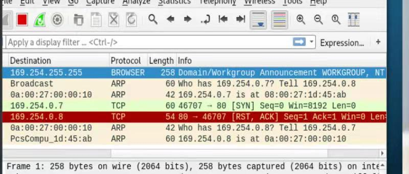
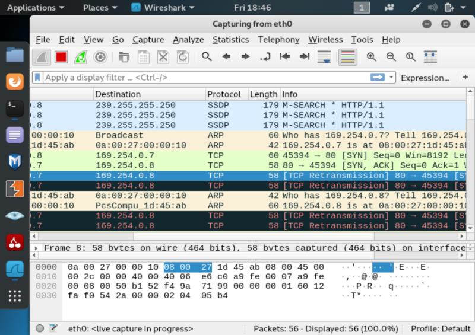
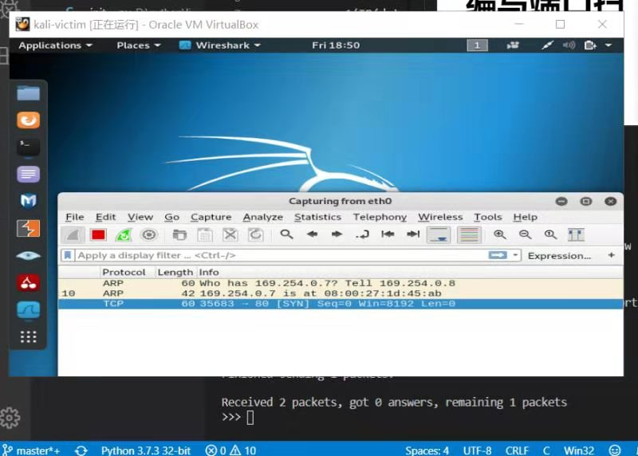
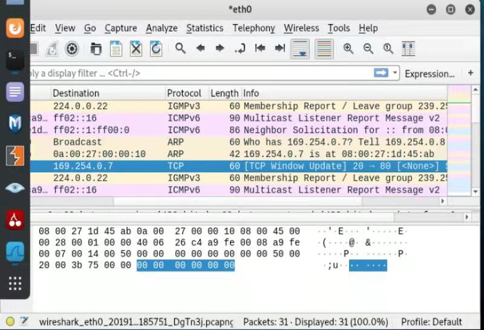
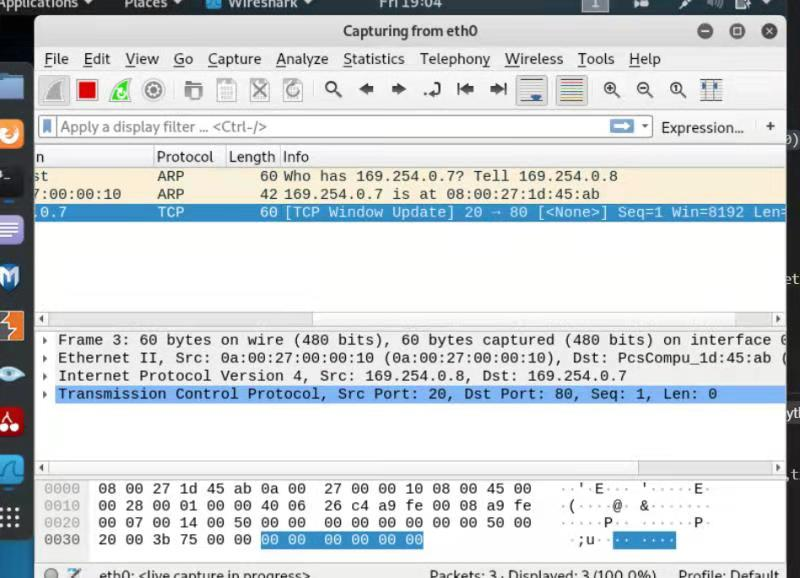

# 基于Scapy 编写端口扫描器

## 实验目的

* 掌握网络扫描之端口状态探测的基本原理
##实验环境
* Python + Scapy
  
## 实验要求
*  完成以下扫描技术的编程实现
    * [x] TCP connect scan 
    * [x] TCP null scan
    * [x] UDP scan
  
## 实验过程
### 网络拓扑

* ```虚拟机-Victim 196.254.0.7```
* ```主机-attacker 169.254.0.3```
### 预期结果
* **TCP connect scan** :客户端向服务器发送一个 SYN 包，若目标端口 open ，则服务器端返回 SYN+ACK 
* **TCP null scan** :若无回复，则目标端口 open，若返回一个 RST 包，则说明端口 closed
* **UDP scan** :若服务器返回 UDP 包，目标端口开放；若返回 ICMP Error（Type 3，Code 3），则端口关闭；若返回 ICMP Error（Type 3，Code 1,2,9,10 or 13），说明端口被过滤；若无任何响应，可能开放或被过滤，无法判断端口状态。

### TCP connect scan
#### 实验代码
```python
import logging
logging.getLogger("scapy.runtime").setLevel(logging.ERROR)
from scapy.all import IP,TCP,sr1,RandShort,send,ICMP,UDP,Raw
dst_ip = "169.254.0.7"
src_port = RandShort()
dst_port=80
tcp_connect_scan_resp = sr1(IP(dst=dst_ip)/TCP(sport=src_port,dport=dst_port,flags="S"),timeout=10)
if(str(type(tcp_connect_scan_resp))==""):
    print "Closed"
elif(tcp_connect_scan_resp.haslayer(TCP)):
    if(tcp_connect_scan_resp.getlayer(TCP).flags == 0x12):
        send_rst = sr(IP(dst=dst_ip)/TCP(sport=src_port,dport=dst_port,flags="AR"),timeout=10)
        print "Open"
elif (tcp_connect_scan_resp.getlayer(TCP).flags == 0x14):
    print "Closed"
 ```
#### 实验结果
- close
 
- open
 
- filter
 


### TCP null scan
#### 实验代码
```python
import logging
logging.getLogger("scapy.runtime").setLevel(logging.ERROR)
from scapy.all import *

dst_ip = "169.254.0.7"
src_port = RandShort()
dst_port=80

null_scan_resp = sr1(IP(dst=dst_ip)/TCP(dport=dst_port,flags=""),timeout=10)
if (str(type(null_scan_resp))==""):
    print "Open|Filtered"
elif(null_scan_resp.haslayer(TCP)):
    if(null_scan_resp.getlayer(TCP).flags == 0x14):
        print "Closed"
elif(null_scan_resp.haslayer(ICMP)):
    if(int(null_scan_resp.getlayer(ICMP).type)==3 and int(null_scan_resp.getlayer(ICMP).code) in [1,2,3,9,10,13]):
        print "Filtered"
 ```
 #### 实验结果
 - close
 
- open
 
- filter

### UDP scan
#### 实验代码
```python
import logging
logging.getLogger("scapy.runtime").setLevel(logging.ERROR)
from scapy.all import *

dst_ip = "169.254.0.7"
src_port = RandShort()
dst_port=53
dst_timeout=10

def udp_scan(dst_ip,dst_port,dst_timeout):
    udp_scan_resp = sr1(IP(dst=dst_ip)/UDP(dport=dst_port),timeout=dst_timeout)
    if (str(type(udp_scan_resp))==""):
        retrans = []
        for count in range(0,3):
            retrans.append(sr1(IP(dst=dst_ip)/UDP(dport=dst_port),timeout=dst_timeout))
        for item in retrans:
            if (str(type(item))!=""):
                udp_scan(dst_ip,dst_port,dst_timeout)
        return "Open|Filtered"
    elif (udp_scan_resp.haslayer(UDP)):
        return "Open"
    elif(udp_scan_resp.haslayer(ICMP)):
        if(int(udp_scan_resp.getlayer(ICMP).type)==3 and int(udp_scan_resp.getlayer(ICMP).code)==3):
            return "Closed"
        elif(int(udp_scan_resp.getlayer(ICMP).type)==3 and int(udp_scan_resp.getlayer(ICMP).code) in [1,2,9,10,13]):
            return "Filtered"

print udp_scan(dst_ip,dst_port,dst_timeout)
```
#### 实验结果
- close


## 结果分析
UDP实验只能作出代码中的第一种情况，其他三种抓不到包，代码运行出来的结果没看懂。
